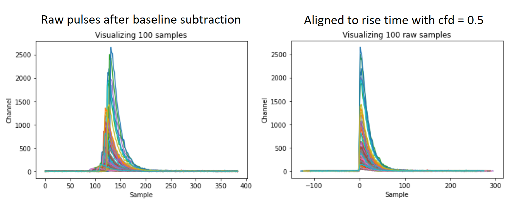
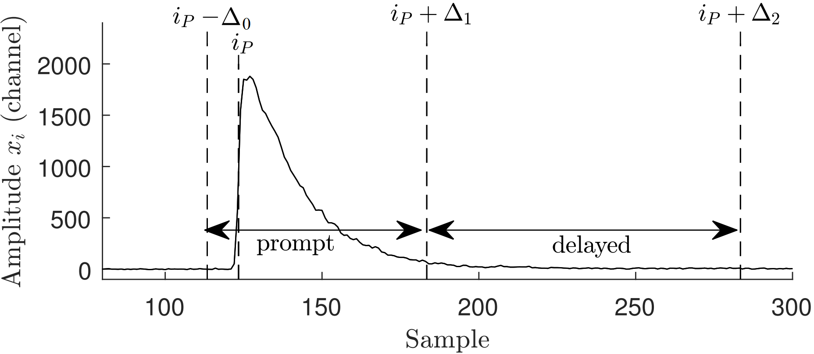
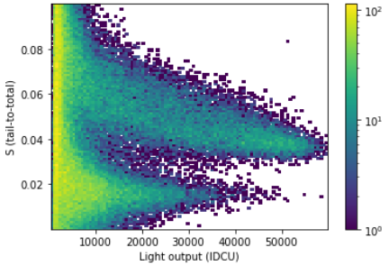

# `scint_psd`

This repo collects numerous methods I have developed throughout my research for analyzing pulse shapes by particle type for organic scintillator radiation detectors. 

**Author: Patricia Schuster, 2020**

**NOTE ON FIGURES**: This repo makes use of the interactive plotting library [`plotly`](https://plotly.com/). Plotly generates interactive visualizations with convenient features such as hoverover and live legends for toggling datasets on and off. When viewing Jupyter notebooks on GitHub, plotly figures will not appear because GitHub renders a *static* view of the notebook. If you wish to see this figures (and... you do), download the repo to your computer and load the notebooks locally.

# Datasets

The following raw data files were used in developing this repo and are available for you to download from [this folder](https://umich.box.com/v/scint-psd-repo-datar). These datasets were collected throughout the research that led to the following papers: [1](https://ieeexplore.ieee.org/document/7465791/), [2](https://www.sciencedirect.com/science/article/pii/S0168900216311342?via%3Dihub), [3](https://ieeexplore.ieee.org/document/8353858/). The files retain their original filenames as recorded in the data collection.   
* Anthracene: `andT_th000_ph065_20150212_155736_signal_raw.mat`, 318 MB  
* P-terphenyl:  `S4DT_th030_ph014_20150928_151727_PTER_1300V_Pos4_signal_raw.mat`, 632 MB  
* Solution-grown trans-stilbene:  `Set_1_Test_20150701_115205_Ch1_Stil_316B_1325V_signal_raw.mat`, 369 MB  
* LLNL PSD-capable plastic:  `Set_1_Test_20150701_115205_Ch3_Plastic_3901_1375V_signal_raw.mat`, 163 MB

This data should be downloaded to [`/data/raw/`](/data/raw).

# Methods  

The following methods will be explained in this repo:

## Load and visualize raw signal

Load array of raw pulses using:

    signal_raw = scint.load_signal_raw(filename)
    fig = scint_vis.plot_raw_pulses(signal_raw, np.arange(100))

Option to align the pulses by rise time using a constant fraction descriminator:

    fig = scint_vis.plot_raw_pulses(signal_raw, np.arange(100), cfd_shift_frac = 0.5)
    

## Calculate `L_ch` (light output) and `S` (pulse shape parameter)

Methods for calculating the light ouput in integrated digitizer channel units (IDCU) and the pulse shape parameter (tail-to-total) are explained in [this notebook](notebooks/dev_calc_L_S.ipynb). Light output can be converted to keVee with a light output calibration.

Here is a figure of a raw pulse, adapted from [3](https://ieeexplore.ieee.org/document/8353858/), that shows the integration windows on the pulse with respect to $i_P$. The step sizes $\Delta_0$, $\Delta_1$, and $\Delta_2$ are input parameters in the functions `scint_psd.calc_L_ch()` and `scint_psd.calc_S()`. 

    L_ch = scint.calc_L_ch(signal_raw,
                           Delta_0 = 10,
                           Delta_2 = 350,
                           cfd_frac = 0.5)
                       
    S = scint.calc_S(signal_raw, 
                     Delta_1 = 60,
                     Delta_2 = 160,
                     Delta_0 = 10,
                     cfd_frac = 0.6)

A plotting method for visualizing `L_ch` vs. `S` in a "PSD Plot" is included in `scint_vis.plot_L_ch_vs_S()`. 

  
* Create a 2-dimensional PSD plot of `L` vs. `S`  
* Calculate the figure-of-merit (FOM) of neutron-gamma separation  

# Installation

Create a new environment with Python version = 3.7 and install the packages in the requirements.txt file. 

<small>Project based on the <a target="_blank" href="https://drivendata.github.io/cookiecutter-data-science/">cookiecutter data science project template</a>. #cookiecutterdatascience</small>

